# Real-Time WebSocket Application Deployment

**Live Access URL:** [https://ephemeral-server.ddnsgeek.com/](https://ephemeral-server.ddnsgeek.com/)

## 1. Project Overview
This repository contains my final submission for the DevOps Engineering Assignment. The objective was to debug and fix a broken staging environment for a real-time WebSocket chat application. I have successfully debugged the container configurations, fixed the networking, deployed the application to an AWS EC2 instance, and fully automated the deployment using a GitHub Actions CI/CD pipeline. 

Additionally, I successfully implemented the optional **Bonus requirement**: securing the application with HTTPS using Let's Encrypt certificates.

## 2. Current Application State & Architecture
The application is now fully operational in a production-style environment on an AWS EC2 instance. It automatically redirects all standard HTTP traffic to a secure HTTPS connection. Multiple users can seamlessly connect via WebSockets and chat in real-time. 

### Architecture Diagram

## 3. How Docker Containers are Set Up
The infrastructure is orchestrated using Docker Compose to run two primary containers:
* **Backend (`chat-backend`)**: Built from the provided `Dockerfile` using `python:3.11-slim`. It runs the FastAPI WebSocket server.
* **Nginx (`chat-nginx`)**: Uses the `nginx:alpine` image to act as the web server and reverse proxy. It mounts local volumes for the frontend files, the Nginx configuration, and the Let's Encrypt SSL certificates. Both containers are set to `restart: always` for maximum uptime.

## 4. How Docker Networking Works
By defining the services in `docker-compose.yml`, Docker automatically places both containers on a shared default bridge network. This allows them to securely communicate with each other using their service names. Nginx can route traffic to the backend via `http://backend:8000` without the backend needing to expose its port to the outside world.

## 5. Nginx Reverse Proxy & WebSocket Configuration
Nginx is configured to handle traffic on two ports:
* **Port 80**: Immediately intercepts HTTP traffic and returns a `301` redirect to HTTPS.
* **Port 443**: Terminates the SSL connection using Let's Encrypt certificates. It serves the static `index.html` file for the `/` route. For the `/ws` route, it acts as a reverse proxy. To successfully pass WebSockets through to the backend, it explicitly forwards the `Upgrade` and `Connection` HTTP headers, keeping the bi-directional tunnel alive.

## 6. What Issues I Found and How I Fixed Them
During debugging, I identified and fixed the following critical issues:
1. **Container Networking Issue (Dockerfile)**: The FastAPI server was binding to `--host 127.0.0.1`. This restricted it to localhost *inside* the container, completely blocking Nginx from connecting. I fixed this by changing it to `--host 0.0.0.0` so it accepts external connections from the Docker network.
2. **Missing UI Issue (docker-compose.yml)**: The volume mapping for the frontend directory was commented out, resulting in Nginx serving its default welcome page instead of the chat app. I uncommented the `- ./frontend:/usr/share/nginx/html:ro` mapping.
3. **WebSocket Tunneling Issue (nginx.conf)**: 
   * `proxy_pass` was incorrectly set to `http://localhost:8000`, causing Nginx to route traffic to itself. I corrected this to point to the backend container: `http://backend:8000/ws`.
   * The `Upgrade` and `Connection` headers were commented out, dropping the WebSocket handshakes. I uncommented them to successfully establish the WebSocket tunnel.

## 7. CI/CD Pipeline Automation
I implemented a CI/CD pipeline using GitHub Actions (`.github/workflows/deploy.yml`) to fully automate the deployment process.

### How the Pipeline Looks
On every `push` to the `main` branch, the pipeline triggers an Ubuntu runner that:
1. Connects securely to the AWS EC2 instance via SSH using `appleboy/ssh-action`.
2. Navigates to the project directory on the EC2 server.
3. Executes a `git pull` to fetch the latest code.
4. Runs `docker compose down` followed by `docker compose up -d --build` to cleanly rebuild and restart the containers.

### Configured Secrets (Variables)
To allow the pipeline to authenticate with the EC2 server securely, I added the following variables to the GitHub Repository Secrets:
* `SERVER_HOST`: The Public IP address of the AWS EC2 instance.
* `SERVER_USER`: The SSH username (e.g., `ubuntu`).
* `SSH_PRIVATE_KEY`: The `.pem` private SSH key used to access the instance.

## 8. Steps to Deploy
1. **Provision EC2**: Launch an AWS EC2 instance and open ports 80, 443, and 22.
2. **Generate SSL**: Install Certbot on the EC2 server and run `certbot certonly --standalone -d <your-domain>` to generate Let's Encrypt certificates.
3. **Initial Setup**: SSH into the server and run `git clone <repository-url> devops`.
4. **Deploy**: Configure the GitHub Secrets and push any code to the `main` branch. The CI/CD pipeline will automatically deploy the application securely over HTTPS.
